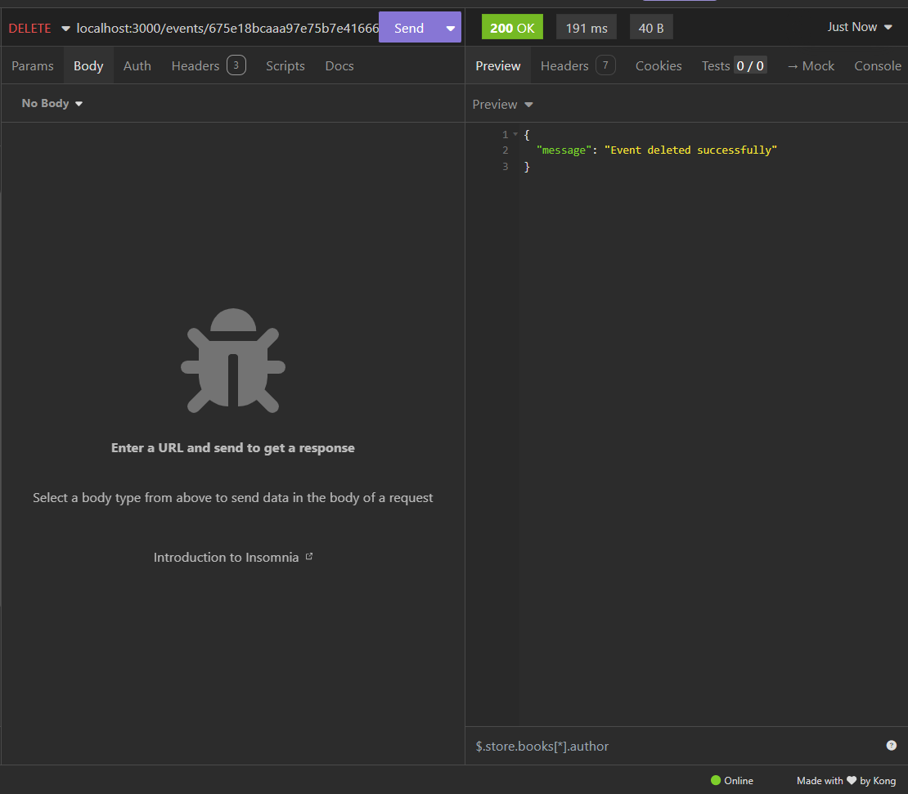

# Eventify

Eventify is a comprehensive campus event management system designed for students and staff to seamlessly view, create, and register for various campus events such as workshops, seminars, and club activities. The platform integrates RSVP functionality, an event calendar, and notifications to ensure efficient event coordination.

---

## Table of Contents

- [Deployment Link](#deployment-link)
- [Sample Login Details](#sample-login-details)
- [Feature Checklist](#feature-checklist)
- [Tech Stack](#tech-stack)
- [Installation Instructions](#installation-instructions)
- [API Documentation](#api-documentation)
  - [Category Endpoints](#categories-endpoints)
  - [Event Endpoints](#event-endpoints)
  - [RSVP Endpoints](#rsvp-endpoints)
  - [User Endpoints](#user-endpoints)
- [Screenshots](#screenshots)

---

## Deployment Link

Access Eventify live via the following link:
[Eventify on Render](https://eventify-campus.onrender.com/)

---

## Sample Login Details

### Admin Functions
- **Email:** [admin@example.com](mailto:admin@example.com)
- **Password:** admin123

### User Functions
- Create an account using the registration form available on the platform.

---
## Feature Checklist

| **Feature**                          | **Details**                                                                                            | **Status**        |
|--------------------------------------|--------------------------------------------------------------------------------------------------------|-------------------|
| **User Registration & Event Preferences** |                                                                                                        | ✅ Completed       |
|                                      | User registration and login functionality implemented.                                                 | ✅ Completed       |
|                                      | Users can set preferences for specific event types.                                                    | ✅ Completed       |
| **Event Listings & RSVP**            |                                                                                                        | ✅ Completed       |
|                                      | Display of upcoming events with the following details:                                                 | ✅ Completed       |
|                                      | - Event name                                                                                           | ✅ Completed       |
|                                      | - Date and time                                                                                        | ✅ Completed       |
|                                      | - Location                                                                                            | ✅ Completed       |
|                                      | - Available seats                                                                                     | ✅ Completed       |
|                                      | Users can RSVP for events:                                                                             | ✅ Completed       |
|                                      | - Updates available seats in real-time.                                                               | ✅ Completed       |
|                                      | - Stores RSVP'd events in the user's profile.                                                         | ✅ Completed       |
| **Event Creation (Admin Only)**      |                                                                                                        | ✅ Completed       |
|                                      | Admins can create events by providing:                                                                 | ✅ Completed       |
|                                      | - Event name                                                                                           | ✅ Completed       |
|                                      | - Date and location                                                                                    | ✅ Completed       |
|                                      | - Description                                                                                          | ✅ Completed       |
|                                      | - Event capacity                                                                                       | ✅ Completed       |
|                                      | Each event is assigned a unique ID.                                                                    | ✅ Completed       |
| **Event Calendar View**              |                                                                                                        | ✅ Completed       |
|                                      | Integrated calendar view for visualizing events by date.                                               | ✅ Completed       |
|                                      | Users can filter events based on their preferences.                                                    | ✅ Completed       |

---

## Tech Stack

- **Frontend:** HTML, CSS, JavaScript
- **Backend:** Node.js, Express.js
- **Database:** MongoDB
- **Deployment:** Render

---

## Installation Instructions

To run the project locally, follow these steps:

### 1. Clone the Repository
```bash
git clone https://github.com/your-username/eventify.git
cd eventify
```

### 2. Install Dependencies
```bash
npm install
```

### 3. Set Up Environment Variables
Create a `.env` file in the root directory and add the following:

```env
PORT=3000
MONGODB_URI=your-mongodb-uri
JWT_SECRET=your-jwt-secret
```

### 4. Start the Server
```bash
npm start
```

### 5. Access the Frontend
Navigate to the `Public` directory and open `index.html` in your browser.

---

## API Documentation

### Categories Endpoints
Endpoints for managing event categories, including creation, deletion, updates, and retrieval.

#### Create Category


#### Delete Category


#### Get Categories


#### Get Category


#### Update Category


---

### Event Endpoints
Endpoints for managing events, including CRUD operations and specific field updates.

#### Create Event


#### Delete Event


#### Get Event


#### Update Event Field


#### Update Event


---

### RSVP Endpoints
Endpoints for handling RSVP-related operations.

#### Create RSVP


#### Delete RSVP


#### Get RSVP


#### Get RSVPs


---

### User Endpoints
Endpoints for user management, including creation, authentication, and retrieval.

#### Delete User


#### Get User


#### Get Users


#### Register User


#### User Login


---

## Screenshots

#### Home Page


#### Features Section


#### Login Page


#### User Dashboard


#### Event Calendar


---

Thank you for using Eventify!

